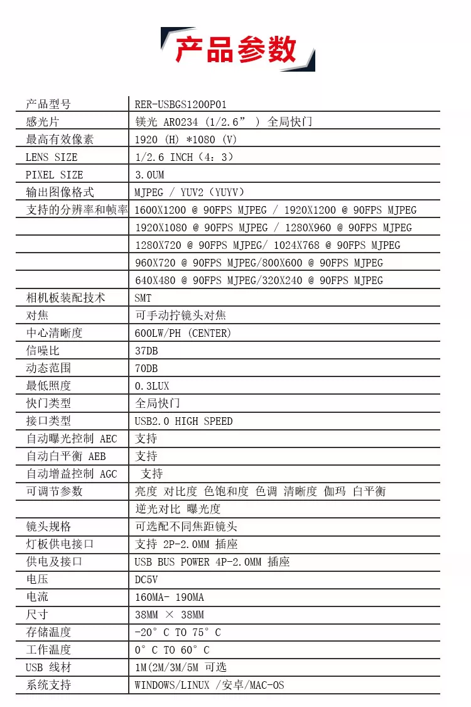
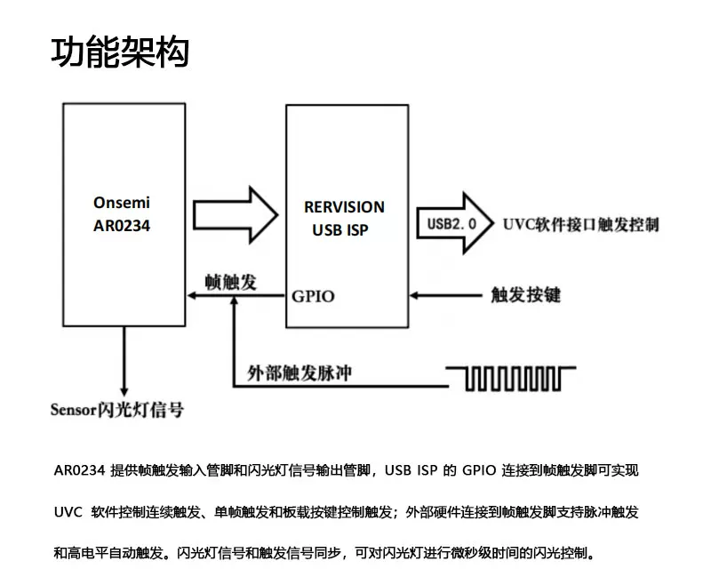
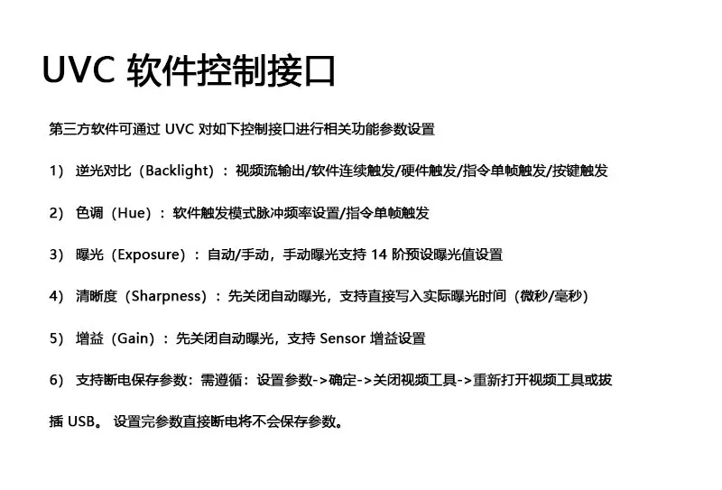
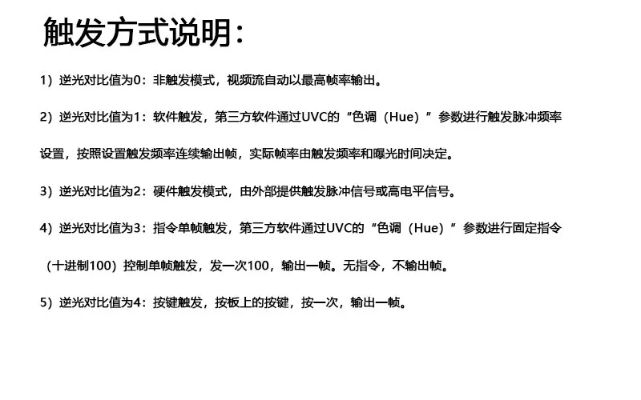
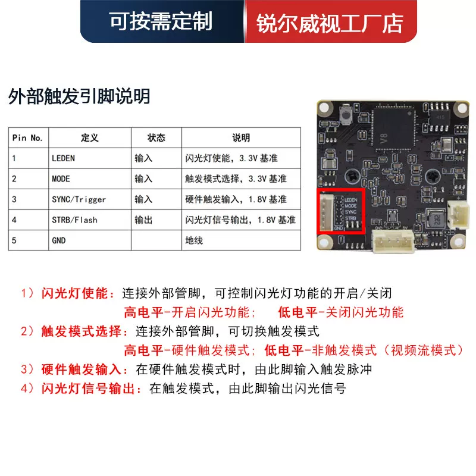
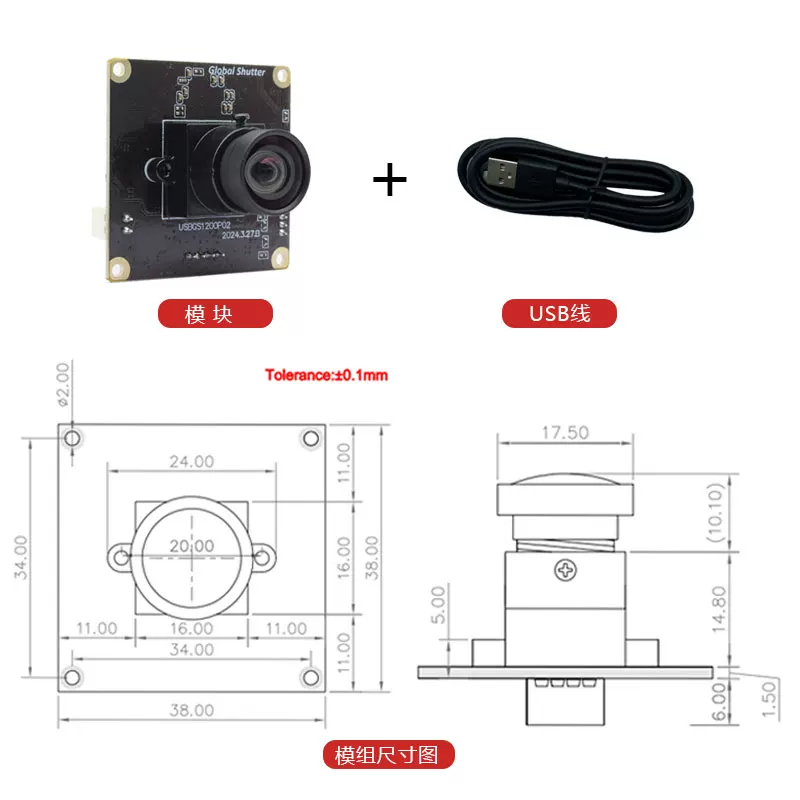

# Pro1 全局快门 USB 相机手册

本手册根据用户提供的六张产品资料图片整理，适用于 Pro1 当前使用的 USB 相机。图片保存在同目录的 `camera-manual-assets/`，以便逐项核对。产品资料描述的是相机能力；实际 USB 模式、帧率、镜头和接线仍以所购实物及现场测试为准。

## 1. 型号与基本参数

| 项目 | 产品资料所列参数 |
| --- | --- |
| 产品型号 | `RER-USBGS1200P01`（按图片文字抄录，建议与模组丝印核对） |
| 图像传感器 | onsemi AR0234，全局快门 |
| 最高有效像素 | 1920 × 1080，约 200 万像素 |
| 传感器尺寸 / 像素尺寸 | 1/2.6 英寸；3.0 μm |
| 视频输出格式 | MJPEG、YUV2（YUYV/YUY2） |
| 数据接口 | USB 2.0 High Speed，UVC |
| 供电 | USB 总线 DC 5 V；产品资料标注电流 160–190 mA |
| 板尺寸 | 38 × 38 mm |
| 镜头 | 可选不同焦距，支持手动对焦；图片未指明当前实物的镜头焦距 |
| 系统 | 产品资料列出 Windows、Linux、Android、macOS |

产品资料另列出中心清晰度 600 LW/PH、信噪比 37 dB、动态范围 70 dB、最低照度 0.3 lux、存储温度 −20～75 °C、工作温度 0～60 °C，以及 SMT 板装工艺。这些均为厂家资料值，未在 Pro1 中实测。

## 2. 分辨率与帧率

产品图片列出的下列 **90 FPS 均标注为 MJPEG 模式**：

| 分辨率 | 标注格式与帧率 |
| --- | --- |
| 1920 × 1200 | MJPEG，90 FPS |
| 1920 × 1080 | MJPEG，90 FPS |
| 1600 × 1200 | MJPEG，90 FPS |
| 1280 × 960 | MJPEG，90 FPS |
| 1280 × 720 | MJPEG，90 FPS |
| 1024 × 768 | MJPEG，90 FPS |
| 960 × 720 | MJPEG，90 FPS |
| 800 × 600 | MJPEG，90 FPS |
| 640 × 480 | MJPEG，90 FPS |
| 320 × 240 | MJPEG，90 FPS |

图片没有给出各分辨率 **YUY2** 模式的帧率，不能把表中的 90 FPS 套用到 YUY2。USB 2.0 的理论链路速率为 480 Mb/s；例如 640 × 480 的 YUY2 图像按每像素 2 字节、90 FPS 计算，未计协议开销就约为 55 MB/s，因此实际可用帧率必须测量。

**资料内有一处待核实矛盾：** 参数表同时写“最高有效像素 1920 × 1080”和“1920 × 1200 @ 90 FPS”。后者超过前者的高度；在取得设备 UVC 模式枚举或厂家进一步说明前，不将 1920 × 1200 视为已验证的原生模式。

## 3. 当前 Pro1 使用方式

`vision/config.py` 默认请求 **640 × 480、YUY2**，采集帧率设为不主动限帧；相机连接和场地识别走连续视频流。当前项目没有使用外部硬件触发、闪光同步或多相机同步。商品标称的 MJPEG 90 FPS 不是 Pro1 当前 YUY2 配置的实测帧率。

源码注释记录：现场相机请求 960 × 720 时曾返回 960 × 540，造成 4:3 视野被裁成 16:9，因此默认选用 640 × 480。不同电脑、线材和相机固件可能影响实际协商结果；变更配置后应同时记录请求值、设备返回值和成功读帧率。如需确认画面没有重复，还应单独检查相邻帧内容；成功读帧率本身不能证明每帧图像都不同。

## 4. 工作结构和触发接口

AR0234 传感器连接 USB ISP，经 USB 2.0 输出 UVC 视频。产品资料显示，ISP GPIO 可连接传感器帧触发输入；传感器还提供闪光灯同步信号。相机支持连续输出、软件触发、外部硬件触发、指令单帧触发和板载按键触发。

### UVC 控制项

产品资料将部分标准名称的 UVC 控件用于厂商自定义功能。操作时应以这台相机的实际控件行为为准，不要仅按控件英文名称推断用途。

| UVC 控件 | 产品资料描述的用途 |
| --- | --- |
| 逆光对比 `Backlight` | 选择连续输出、软件连续触发、硬件触发、指令单帧触发或按键触发模式 |
| 色调 `Hue` | 软件触发脉冲频率；在指令单帧模式发送数值 100 触发一帧 |
| 曝光 `Exposure` | 自动或手动；手动曝光提供 14 档预设值 |
| 清晰度 `Sharpness` | 关闭自动曝光后，可写入实际曝光时间，资料注明单位可为微秒/毫秒 |
| 增益 `Gain` | 关闭自动曝光后设置传感器增益 |

产品资料还列出亮度、对比度、色饱和度、白平衡、伽马和逆光对比等可调项。它要求按“设置参数 → 确定 → 关闭视频工具 → 重新打开视频工具或拔插 USB”的顺序验证断电保存；单纯设置后拔掉 USB 不一定保存。

### 触发模式

下表数值对应产品资料中的 `Backlight` 设置：

| 值 | 模式 | 输出行为 |
| ---: | --- | --- |
| 0 | 非触发 | 连续视频流，以当前模式允许的最高帧率输出 |
| 1 | 软件触发 | 通过 `Hue` 设置触发脉冲频率；实际帧率受触发频率和曝光时间限制 |
| 2 | 硬件触发 | 从外部引脚输入脉冲或高电平触发 |
| 3 | 指令单帧 | 通过 `Hue` 发送十进制数值 100 输出一帧；无指令时无帧 |
| 4 | 按键触发 | 按一次板载按键输出一帧 |

### 外部引脚

| 引脚 | 名称 | 方向 | 产品资料所列电平和作用 |
| ---: | --- | --- | --- |
| 1 | `LEDEN` | 输入 | 闪光灯使能，3.3 V 基准；高电平开启，低电平关闭 |
| 2 | `MODE` | 输入 | 触发模式选择，3.3 V 基准；高电平为硬件触发，低电平为非触发视频流 |
| 3 | `SYNC/Trigger` | 输入 | 硬件触发输入，**1.8 V 基准** |
| 4 | `STRB/Flash` | 输出 | 闪光灯同步信号，**1.8 V 基准** |
| 5 | `GND` | 地 | 公共地 |

`SYNC/Trigger` 和 `STRB/Flash` 标注为 1.8 V 电平；如将来连接 3.3 V 控制器，应先核对厂家电气规格并设计电平转换。当前 Pro1 只使用 USB 连续采集，无需连接这些引脚。

## 5. 外形与安装

产品图片显示模组外形约 38 × 38 mm，四角安装孔中心距约 34 × 34 mm，孔径标注为 2.00 mm，尺寸公差标注为 ±0.1 mm。镜头和背面连接器会突出 PCB；设计支架时应以实物测量的镜头高度、背面净空和 USB 插头空间为准。

## 6. 现场核对清单

1. 核对实物型号、镜头焦距、线材长度和 USB 连接速度。
2. 枚举设备实际公开的 MJPEG/YUY2 分辨率与帧率，记录所用 USB 控制器和端口。
3. 在 Pro1 默认 640 × 480 YUY2 模式下，记录实际返回尺寸、成功读帧率及重复画面情况。
4. 若尝试 MJPEG 或改变分辨率，先检查完整视野、畸变、曝光、延迟和 YOLO 识别结果，再决定是否修改默认配置。
5. 只有在接入外部触发时，才验证 UVC 模式切换、引脚电平和同步时序。
